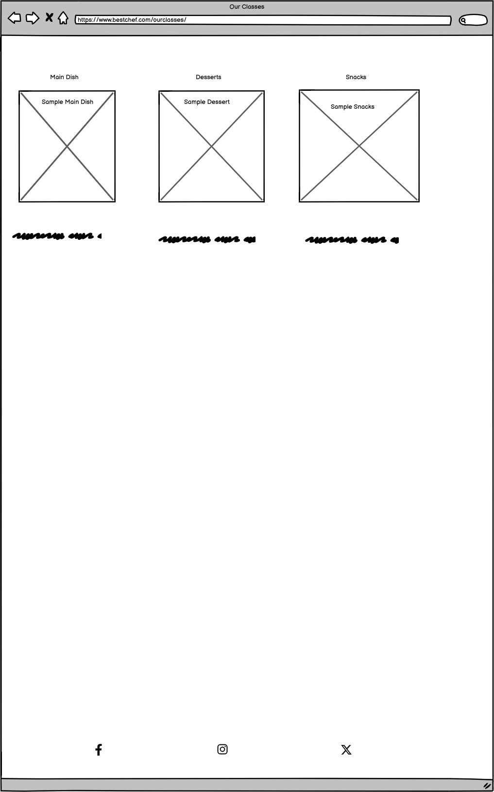
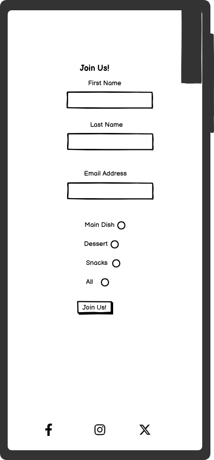
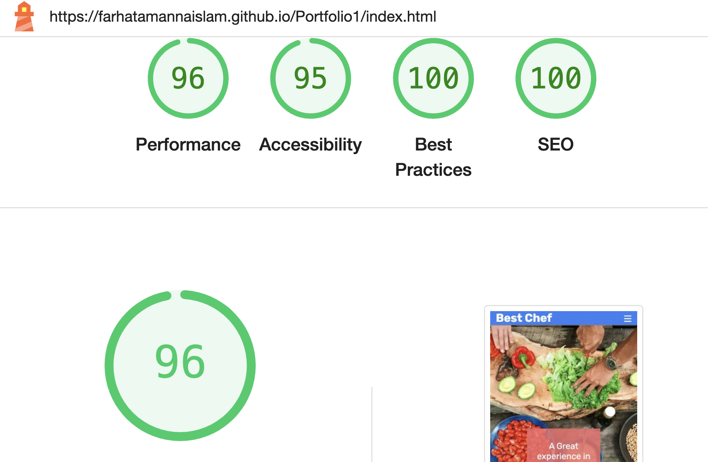
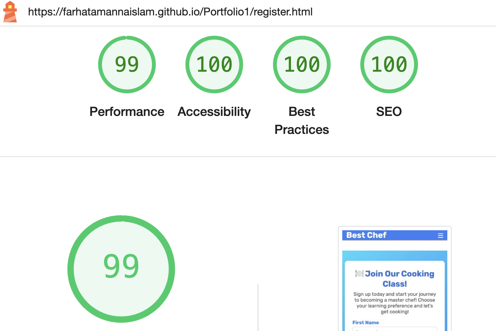

# Best Chef

Best Chef is a Website for a cooking course that gives brief overview of its content.

Users of this website can find about more about its teaching modules, basic recipes that are taught, some example recipe pictures
and a Registration for interested users who can join the course as well as the address where the course happens.

The live link can be found here - [Best Chef](https://farhatamannaislam.github.io/Portfolio1/)

# Overview
* This website is designed as a three-page website with contents such as Home, Our Classes and Register.
* To provide the user with clear idea about the course three main section of recipes and example image of the corresponding recipe is provided.
* To enable the user to locate the course and allow the user to register for the course.

# Design

## Imagery
The imagery used in this website is very important for the user to get a basic idea about the course. The food pictures give the user a clear idea 
about what is taught. The color of the website is very vibrant.

## Fonts 
The Rubik font is the main font used throughout the whole website. This font was imported via [Google Fonts](https://fonts.google.com/). Sans Serif is used as backup font.

# Wireframes

Wireframes are produced using Balsamiq.

Desktop Wireframe

Desktop Wireframe

Desktop Wireframe

Mobile Wireframe

Mobile Wireframe

Mobile Wireframe

# Menu Navigation

* It is located at the top of the website.
* It has a fixed position at the top so that users have access to the menu at all times when scrolling through the content.

* On small screens, when the navigation links do not fit in a single row, the menu transforms into a "hamburger" menu.

* Once the "hamburger" icon is clicked, the menu expands to make navigation links visible to the user.

# Home Section

* It contains a Hero image showing a beautiful cooking photo and a text overlay with the website headline.
* It contains a reason section about why the user will choose this course.
* It contains the course address.

# Our Classes Page

* In this page the user finds information about various sections of recipes that are taught in the classs along with
a relevant sample image.

# Register Page

* It contains an engaging message for the user to register the course (first name, last name, email, choose course option via the contact form).

# Website Footer

* It contains links to social media platforms.

# Testing

## Validator Testing

* No errors were returned when passing through the official W3C Markup Validator

    [W3C Validator Home](https://validator.w3.org/nu/?doc=https%3A%2F%2Ffarhatamannaislam.github.io%2FPortfolio1%2F)
    [W3C Validator Our Classes](https://validator.w3.org/nu/?doc=https%3A%2F%2Ffarhatamannaislam.github.io%2FPortfolio1%2Fourclasses.html)
    [W3C Validator Register](https://validator.w3.org/nu/?doc=https%3A%2F%2Ffarhatamannaislam.github.io%2FPortfolio1%2Fregister.html)

* No errors were found when passing through the official W3C CSS Validator

    [W3C validor CSS](https://jigsaw.w3.org/css-validator/validator?uri=https%3A%2F%2Ffarhatamannaislam.github.io%2FPortfolio1%2Fassets%2Fcss%2Fstyle.css&profile=css3svg&usermedium=all&warning=1&vextwarning=&lang=en)

* The site achieved a Lighthouse accessibility score of 94% to 100% which confirms that the colours and fonts chosen are easy to read and accessible.

# Form Testing

* The form has been tested to ensure it would not submit without the required input fields being filled in (full name and email address).

# Links Testing

* All navigation links were tested manually to ensure the user is directed to the correct section of the website.
* Social Media links in the footer of each page were tested manually to ensure they direct the user to the correct page and open in a new tab.

# Browser Testing

* The Website was tested on Google Chrome, Firefox, Microsoft Edge, Safari browsers with no issues noted.

# Device Testing

* The website was viewed on a variety of devices such as Desktop, Laptop, Tablets and Mobiles  to ensure responsiveness on various screen sizes. The website performed as intended. The responsive design was also checked using Chrome developer tools across multiple devices with structural integrity holding for the various sizes.

* Following Websites are used to show responsiveness.

    [Responsitor](http://www.responsinator.com/?url=https%3A%2F%2Ffarhatamannaislam.github.io%2FPortfolio1%2F)
    [Am I Responsive](https://ui.dev/amiresponsive?url=https://farhatamannaislam.github.io/Portfolio1/)

# Bugs

* There are no known bugs in the website.

# Technologies Used

## Languages

* HTML5
* CSS

# Frameworks - Libraries - Programs Used

* [Am I Responsive](https://ui.dev/amiresponsive) Used to verify responsiveness of website on different devices.
* [Responsitor](http://www.responsinator.com/) Used to verify responsiveness of website on different devices.
* [Balsamiq](https://balsamiq.com/) Used to create Wireframes.
* [Chrome Dev Tools](https://developer.chrome.com/docs/devtools/) Used for overall development (debug, analysis, performance test, responsiveness).
* [Font Awesome](https://fontawesome.com/) Used for Social Media icons in footer.
* [GitHub](https://github.com/) Used for version control and hosting.
* [Google Fonts](https://fonts.google.com/) Used to import and alter fonts on the page.
* [TinyPNG](https://tinypng.com/) Used to optimize the images for web.
* [Convertio](https://convertio.co/) Used to optimize the images for web.
* [Flaticon](https://www.flaticon.com/) Used to get the icon for the website.
* [W3C](https://www.w3.org/) Used for HTML & CSS Validation.

# Deployment

* In the Github repository, I navigated to Settings tab.
* From the source section drop-down menu, I selected the main branch and Save.
* A few moments later, the page was automatically refreshed and the link to the website was displayed on the right side of the page.

The live link can be found here - [Best Chef](https://farhatamannaislam.github.io/Portfolio1/index.html)

# Credits

## Media

All images sourced from the below website with thanks to the below amazing photographers.

* [Pexels](https://www.pexels.com/)

## Resources

* [StackOverflow](https://stackoverflow.com/)
* [W3Schools](https://www.w3schools.com/)
* [Love-Running Project](https://github.com/farhatamannaislam/love-running)

# Acknowledgments

* My mentor Antonio Rodriguez for his valueable support and advice.
* Code Institute Slack community and tutors for their helpful responses and feedback.

